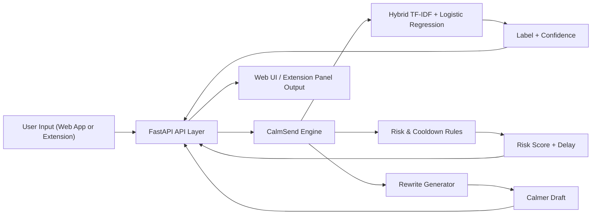
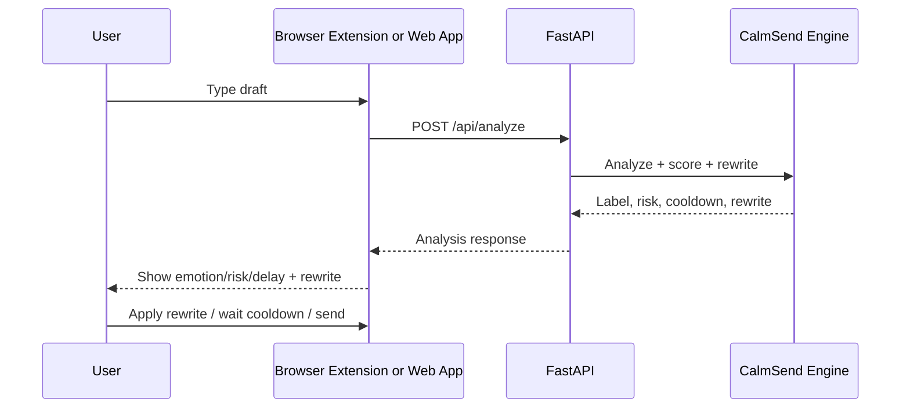

# CalmSend

CalmSend is an AI emotional message delay system for web communication workflows. It analyzes user
text, scores emotional risk, applies cooldown logic, and suggests safer rewrites before users send
messages in chat, social, email, and document contexts.

## Technology

- Frontend: React 18, Vite 5
- Backend: FastAPI, Python 3.14
- NLP/ML: scikit-learn, TF-IDF (word + char), Logistic Regression ensemble
- Extension: Chrome Manifest V3 content assistant
- CI/CD: GitHub Actions

## Core capabilities

- Emotion/risk classification (`safe`, `caution`, `high_risk`)
- Risk score and anger-level style feedback
- Delay modes (`off`, `light`, `smart`, `strict`)
- Cooldown-based send intervention
- Auto rewrite suggestion for high-risk drafts
- Linked-app settings for WhatsApp Web, Instagram, Gmail, and Google Docs
- Web app analysis workflow for standalone usage and deployment

## Architecture



## Workflow diagram



## Installation

### 1) Clone and install dependencies

```bash
git clone https://github.com/MaramMaruthiChethan/calmsend.git
cd calmsend
```

Backend:

```bash
cd backend
python3 -m venv .venv
source .venv/bin/activate
pip install -r requirements.txt
```

Frontend:

```bash
cd ../frontend
npm install
```

### 2) Run locally

Run backend:

```bash
cd backend
source .venv/bin/activate
uvicorn app.main:app --reload
```

Run frontend dev server:

```bash
cd ../frontend
npm run dev
```

Or build frontend from repo root:

```bash
cd ..
npm run build
```

### 3) Extension setup

1. Open `chrome://extensions`
2. Enable Developer mode
3. Click Load unpacked
4. Select `.../calmsend/extension`
5. Keep backend running on `http://127.0.0.1:8000`

## Deployment model

- FastAPI serves `/api/*`
- If `frontend/dist` exists, FastAPI serves web app static files at `/`
- Build once with `npm run build`, then run FastAPI in production mode

## API

### `POST /api/analyze`

Request:

```json
{
  "message": "I am angry right now.",
  "recipient": "Jordan",
  "source_app": "whatsapp",
  "content_type": "chat",
  "delay_mode": "smart"
}
```

Response includes:

- `label`, `confidence`
- `risk_score`
- `cooldown_seconds`
- `rewritten_message`
- `blocked_features`

### `GET /api/settings`

Returns linked app configuration and default delay mode.

### `PUT /api/settings`

Updates linked app configuration.

### `GET /api/integrations`

Returns supported app definitions and launch URLs.

### `POST /api/train`

Retrains and persists model artifacts.

## CI/CD

- CI workflow runs on push/PR:
  - Python tests
  - Frontend build
  - Extension syntax checks
- CD workflow runs on push to `main`:
  - Builds frontend
  - Packages deploy artifact (`backend`, `frontend/dist`, `extension`, metadata)

## Repository structure

- `backend/` FastAPI + ML engine
- `frontend/` React web app
- `extension/` Chrome extension
- `.github/workflows/` CI/CD pipelines

## License

This project is licensed under the MIT License. See [LICENSE](./LICENSE).
